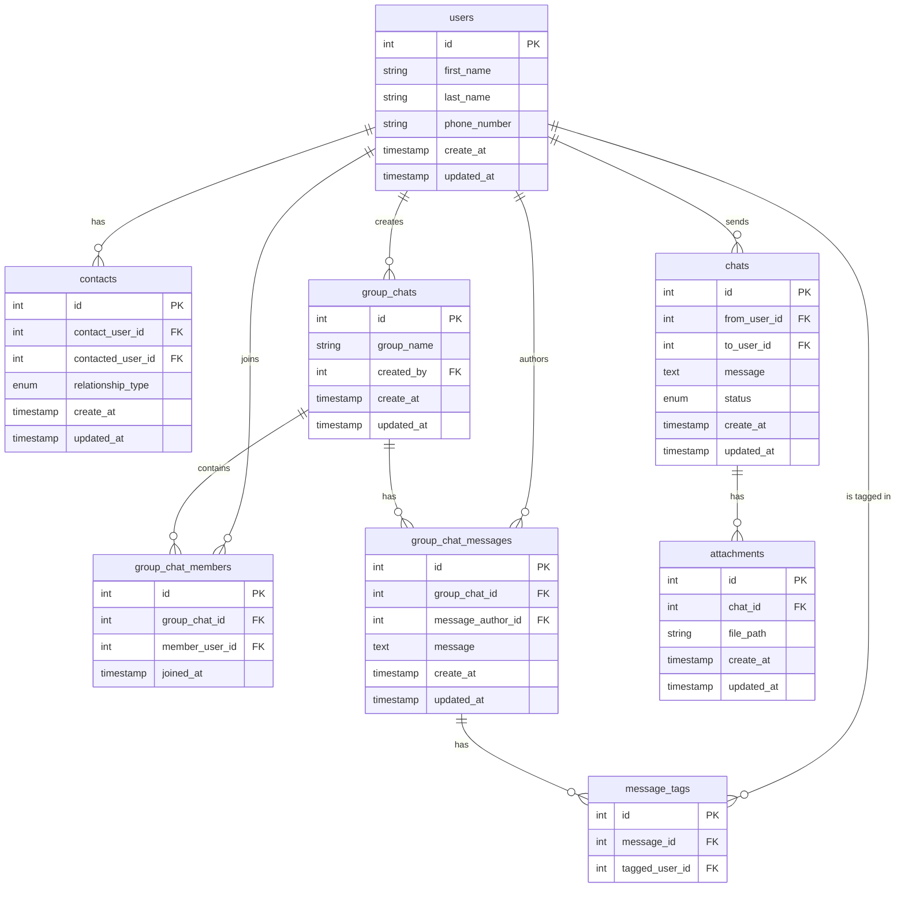

# Chat System Database Schema

## Entity Relationship Diagram

## Database Schema Description

This database schema represents a chat system with support for:
- Direct messaging between users
- Group chats
- Contact management
- File attachments
- Message tagging
- Message status tracking

## Key Features

- User management with contact relationships
- Support for both direct and group messaging
- File attachment capabilities
- Message status tracking (sent, delivered, read)
- User tagging in messages
- Timestamps for all records